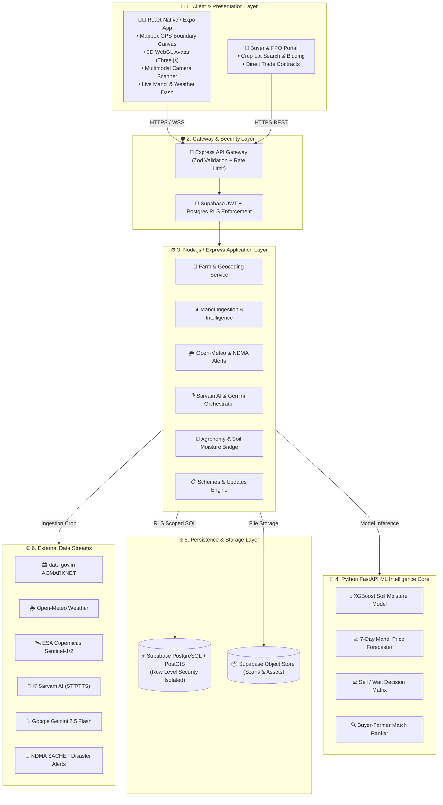

# 🌱 KrishiNetra 2.0 — AI Smart Farming & Agricultural Market Intelligence Platform

<p align="center">
  <b>Empowering farmers with Earth observation satellite intelligence, real-time mandi price discovery, multilingual voice AI, and transparent market linkages.</b>
</p>

<p align="center">
  <a href="#-tech-stack"></a>
  <a href="#-tech-stack"></a>
  <a href="#-tech-stack"></a>
  <a href="#-tech-stack"></a>
  <a href="#-tech-stack"></a>
  <a href="#-license"></a>
</p>

---

## 📌 Overview & Problem Statement

Small and marginal farmers frequently face severe market information asymmetry: lack of visibility into real-time mandi prices, inability to forecast price trends, reliance on middlemen, and lack of field-level agronomic intelligence. **KrishiNetra 2.0** solves this by putting an end-to-end digital agronomy assistant, satellite Earth observation pipeline, and transparent price discovery engine directly into the farmer's hands.

---

## 🚀 Key Features

### 🛰️ 1. Satellite Earth Observation & Field Intelligence
* **ESA Copernicus Sentinel-1 & 2 Integration**: Combines Sentinel-1 Synthetic Aperture Radar (SAR $VV, VH$ backscatter) with Sentinel-2 optical multispectral bands (NDVI, NDWI).
* **XGBoost Soil Moisture Estimation**: Delivers high-resolution soil moisture percentages without requiring expensive physical ground sensors.
* **Topographic Terrain Analysis**: Computes elevation, slope angle, and runoff risk to optimize field-level irrigation scheduling.
* **Geodesic Land Mapping**: Mapbox & Google Maps satellite canvas allows farmers to draw GPS polygon boundaries and calculate geodesic acreage (acres/hectares) with automatic district centroid reverse-geocoding.

### 📊 2. Real-Time Mandi Intelligence & Price Discovery
* **AGMARKNET Ingestion Engine**: Automated, idempotent ingestion pipeline pulling live daily arrivals, modal, minimum, and maximum prices from `data.gov.in`.
* **MSP Comparison & Benchmark**: Compares live mandi rates against government published Minimum Support Prices (MSP) to guarantee floor value visibility.
* **7-Day Price Forecasting**: Time-series ML model forecasting mandi price trajectories to advise farmers whether to **Sell Now**, **Wait / Hold**, or **Sell Partially**.
* **Fayda Profit Simulator**: Simulates net realization after accounting for storage costs, transit expenses, and market commissions.

### 🤖 3. Multilingual 3D Voice Avatar & Vision AI
* **Indic Voice Assistant (Sarvam AI)**: Multilingual Speech-to-Text (`saaras:v1`) and Text-to-Speech (`bulbul:v1`) supporting 22 Indic languages (Hindi, Marathi, Rajasthani, Telugu, Tamil, etc.).
* **Zero-Hallucination Grounded AI (Google Gemini 2.5 Flash)**: Answers farmer queries strictly using verified field data, ingested mandi rates, and district weather observations.
* **Rigged 3D WebGL Avatar**: Three.js avatar running in an isolated WebView with deterministic speech-cadence animations and gestures.
* **Live Multimodal Camera Scanner**: Camera-based visual diagnostic tool powered by Gemini Multimodal Live API for real-time crop disease, pest infestation, and nutrient deficiency identification.
* **Voice In-App Navigation**: Voice commands automatically route the user to relevant app screens via the internal navigation registry.

### 📢 4. Krishi Updates, Emergency Alerts & Government Schemes
* **NDMA SACHET Disaster Warnings**: Real-time alerts for impending hailstorms, heavy rainfall, frost, and extreme heatwaves.
* **Agricultural News Feed**: Real-time news curated from GDELT and official government press releases from PIB.
* **State & National Schemes Discovery**: Complete catalog of government subsidies (PM-Kisan, drip irrigation subsidies, crop insurance) with one-click eligibility matching.

### 🤝 5. Market Linkages & Transparent Buyer Matching
* **Digital Crop Lot Creation**: Farmers can generate verified crop lots containing quantity, quality metrics, and geospatial field provenance.
* **Direct Buyer & FPO Matching**: Weighted proximity matching connects farmers directly with verified institutional buyers, processors, and FPOs, bypassing intermediaries.

---

## 🏛️ System Architecture



---

## 📂 Repository Layout

```text
├── mobile/                  # React Native (Expo SDK 52) Mobile Application
│   ├── assets/              # Avatar 3D GLB assets, icons, splash screens
│   └── src/
│       ├── components/      # 3D Avatar stage, charts, audio visualizers, cards
│       ├── features/        # Auth, avatar state machine, demo mode guards
│       ├── i18n/            # Multilingual translations (EN, HI, MR, etc.)
│       ├── navigation/      # Stack & Tab navigators, voice action routes
│       ├── screens/         # Home, Market, Field, VisualAssistant, Schemes, Updates
│       ├── services/        # API client, agronomy, location, and cache services
│       └── theme/           # Design system tokens and agricultural palette
│
├── backend/                 # Node.js + Express + TypeScript API Server
│   ├── src/
│   │   ├── ai/              # Sarvam STT/TTS, Gemini 2.5 Flash, Prompt engineering
│   │   ├── controllers/     # REST controllers (Farms, Crops, Ingestion, AI, Live)
│   │   ├── ingestion/       # AGMARKNET market, Open-Meteo weather, Nominatim geocode
│   │   ├── middleware/      # Supabase JWT authentication & Zod validation
│   │   ├── routes/          # API router definitions
│   │   ├── schemas/         # Zod schemas for request validation
│   │   ├── scripts/         # Ingest & seed CLI runners (market, weather, schemes)
│   │   ├── services/        # Business logic, PostGIS spatial queries, market trends
│   │   └── updates/         # NDMA SACHET alerts, GDELT news, deduplication filters
│
├── ml/                      # Python FastAPI ML & Earth Observation Service
│   ├── app/                 # FastAPI routes & satellite analysis endpoints
│   ├── krishinetra_ml/      # XGBoost soil moisture & price prediction packages
│   ├── models/              # Serialized XGBoost model artifacts
│   ├── notebooks/           # Sentinel SAR & AGMARKNET EDA/training notebooks
│   └── main.py              # FastAPI microservice entrypoint
│
├── supabase/                # Database Migrations & Schemas
│   └── migrations/          # 0001 to 0005 SQL migrations (PostGIS, RLS, Seed data)
│
└── docs/                    # PRD, TRD, HLD, Architecture diagrams & specifications
```

---

## 🛠️ Technology Stack

| Layer | Technologies |
|---|---|
| **Mobile Client** | React Native, Expo (SDK 52), TypeScript, Mapbox Maps, Three.js WebGL, `expo-audio`, `expo-camera`, `i18next` |
| **Backend API** | Node.js (v20+), Express.js (v5), TypeScript, Zod, Multer, Helmet, Express Rate Limit |
| **Machine Learning** | Python 3.11, FastAPI, XGBoost, LightGBM, Scikit-learn, Pandas, NumPy, Google Earth Engine / Copernicus API |
| **Database & Auth** | Supabase, PostgreSQL 15+, PostGIS Spatial Extensions, Row Level Security (RLS) |
| **AI & Voice** | Google Gemini 2.5 Flash, Gemini Multimodal Live API, Sarvam AI (`saaras:v1`, `bulbul:v1`) |
| **External Providers** | `data.gov.in` AGMARKNET, Open-Meteo Weather API, ESA Copernicus Sentinel-1/2, NDMA SACHET |

---

## ⚡ Getting Started & Local Setup

### 1. Prerequisites
* **Node.js**: v20.x or higher
* **Python**: v3.10+ (for ML services)
* **Android Studio & SDK** / Physical Android Device (Android 8.0+)
* **Supabase Account** (or local Supabase CLI)
* **API Keys**:
  * `GEMINI_API_KEY` (Google AI Studio)
  * `SARVAM_API_KEY` (Sarvam AI)
  * `MARKET_API_KEY` (data.gov.in — optional for live mandi daily rates)

---

### 2. Supabase Setup
Create a Supabase project and execute the migrations in the SQL Editor in order:

```sql
supabase/migrations/0001_phase1_schema.sql
supabase/migrations/0002_phase2_schema.sql
supabase/migrations/0003_seed_reference_data.sql
supabase/migrations/0004_farm_location.sql
supabase/migrations/0005_farmer_identity.sql
```

* Under **Authentication → Providers → Email**: Enable Email/Password authentication.

---

### 3. Backend Setup

```bash
cd backend
cp .env.example .env
```

Fill in `.env`:
```env
PORT=4000
SUPABASE_URL=https://your-project.supabase.co
SUPABASE_ANON_KEY=your-anon-key
SUPABASE_SERVICE_ROLE_KEY=your-service-role-key
GEMINI_API_KEY=your-gemini-key
SARVAM_API_KEY=your-sarvam-key
MARKET_API_KEY=your-data-gov-in-key
```

Install and run the server:
```bash
npm install
npm run dev
# Server running at http://localhost:4000
```

Seed demo data and ingest live market/weather records:
```bash
npm run demo:full
```

---

### 4. Machine Learning Microservice Setup

```bash
cd ml
python -m venv .venv

# On Windows:
.venv\Scripts\activate
# On Linux/macOS:
source .venv/bin/activate

pip install -r requirements.txt
python main.py
# FastAPI service running at http://localhost:8000
```

---

### 5. Mobile App Setup

```bash
cd mobile
cp .env.example .env
```

Fill in `.env`:
```env
EXPO_PUBLIC_API_URL=http://10.0.2.2:4000       # 10.0.2.2 for Android Emulator, or your LAN IP
EXPO_PUBLIC_SUPABASE_URL=https://your-project.supabase.co
EXPO_PUBLIC_SUPABASE_ANON_KEY=your-anon-key
```

Install and launch on Android:
```bash
npm install
npm run android
```

---

## 🧪 Testing & Verification

Run the comprehensive test suites across the workspace:

```bash
# Backend Tests (Jest + Supertest)
cd backend
npm test
npm run typecheck

# Mobile Tests (Jest + React Native Testing Library)
cd mobile
npm test
npm run typecheck

# ML Service Tests
cd ml
python -m unittest discover -s tests
```

---

## 🔒 Security & Zero-Hallucination AI Integrity

1. **PostgreSQL Row Level Security (RLS)**:
   * The mobile app never communicates with Supabase directly for business tables.
   * Every request passes through the Express API with the farmer's verified Supabase JWT; PostgreSQL enforces that farmers can only read/write their own farms, crops, and lots (`WHERE user_id = auth.uid()`).
2. **Server-Side Secret Isolation**:
   * All API keys for Gemini, Sarvam, Supabase Service Role, and data.gov.in are kept exclusively in server environment variables. Zero keys are bundled into client APKs.
3. **Strict Zero-Hallucination Guardrails**:
   * Gemini 2.5 Flash prompts are dynamically injected with factual records (exact mandi modal rates, dates, observed rainfall).
   * The system prompt strictly prohibits inferring or inventing predictions, prices, or recommendations when data is absent, cleanly reporting status as *"service not connected"* instead.

---

## 👥 Data Sources & Acknowledgements

* [data.gov.in AGMARKNET](https://data.gov.in/) — Daily mandi arrivals & price bulletins
* [Open-Meteo](https://open-meteo.com/) — High-resolution meteorological data
* [ESA Copernicus Open Access Hub](https://scihub.copernicus.eu/) — Sentinel-1 SAR & Sentinel-2 MSI data
* [Sarvam AI](https://sarvam.ai/) & [Google Gemini](https://ai.google.dev/) — Indic voice intelligence & multimodal AI

---

## 📄 License

Distributed under the MIT License. See `LICENSE` for more information.


